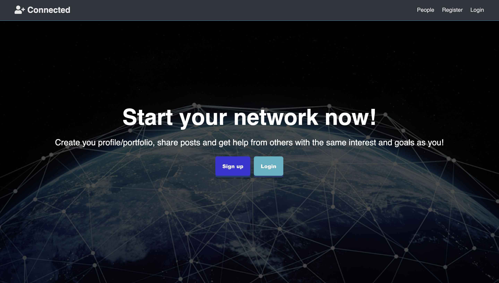
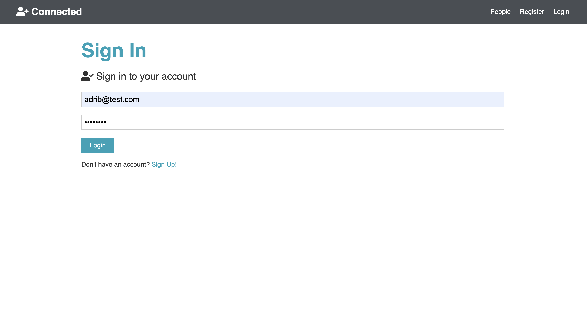
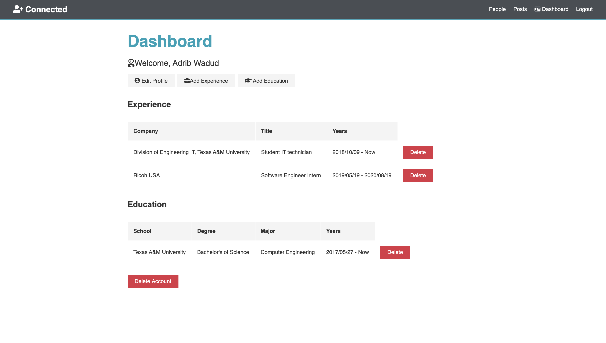
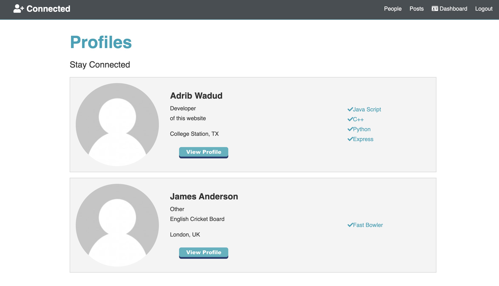
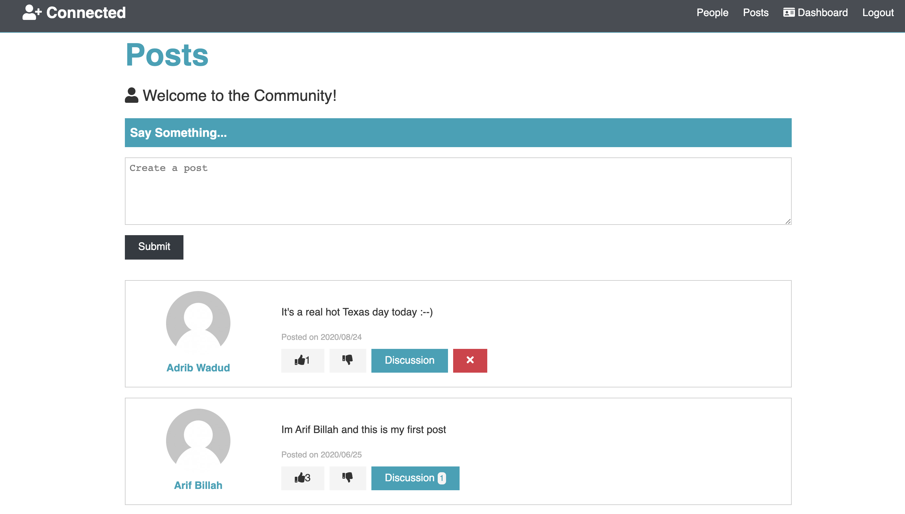
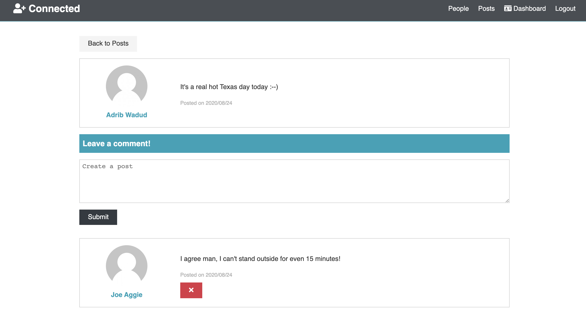

# Simple_Social_Network_named_-Connected
## A simple Social Network

Built a basic social network using MERN(MongoDB, Express JS, React JS and Node JS) stack from scratch. Used Express JS to build the backend web framework, React JS for fornt-end work, MongoDB for database and Node JS as the run time environement.

Users can create an account with an email and password. 

Before the application creates an account and inserts data in the database, the client-side and server-side validation is done to check for a valid email, password(has to be more than 6 characters) and also check whether another account exists with the same email. 

Once, the validations pass the password is hashed and user info is stored. The user gets redirected to the login page where another server-side validation is done for email and password match with the database.

After creating an account, the user can make and edit his/her profile and also view others. 

Profile info contains education, experiences, current status, and a gravatar(Profile picture). 

Users who have an account can also create/edit posts and, comment/like on posts made by other users. Finally, the user can delete his/her posts, comments, and likes and also permanently delete the account on demand.

# The homepage:

# Login Page:

# Profile Dashboard:

# View Profiles:

]

# View Individual Profile:

# View Posts:

# View Comments:

